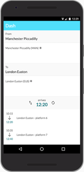

# Dash 

ReasonML PWA for UK trains times.

## Example

https://www.dashh.app

## Code quality

No

### Getting started

#### Prod build

1. yarn install
1. npm run build 
1. npm server
1. localhost:9000

#### Dev

1. yarn install
1. Across a couple of terms
  1. npm run start
  1. npm run webpack
  1. npm run server
1. localhost:9000